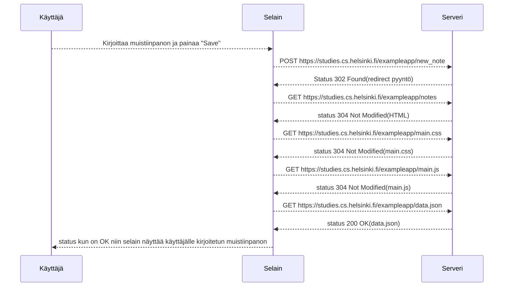

```mermaid
sequenceDiagram
  participant Käyttäjä
  participant Selain
  participant Serveri

  Käyttäjä-->>Selain: Kirjoittaa muistiinpanon ja painaa "Save"
  Selain-->>Serveri: POST https://studies.cs.helsinki.fi/exampleapp/new_note
  Serveri-->>Selain: Status 302 Found(redirect pyyntö)
  Selain-->>Serveri: GET https://studies.cs.helsinki.fi/exampleapp/notes
  Serveri-->>Selain: status 304 Not Modified(HTML)
  Selain-->>Serveri: GET https://studies.cs.helsinki.fi/exampleapp/main.css
  Serveri-->>Selain: status 304 Not Modified(main.css)
  Selain-->>Serveri: GET https://studies.cs.helsinki.fi/exampleapp/main.js
  Serveri-->>Selain: status 304 Not Modified(main.js)
  Selain-->>Serveri: GET https://studies.cs.helsinki.fi/exampleapp/data.json
  Serveri-->>Selain: status 200 OK(data.json)
  Selain-->>Käyttäjä: status kun on OK niin selain näyttää käyttäjälle kirjoitetun muistiinpanon
```
