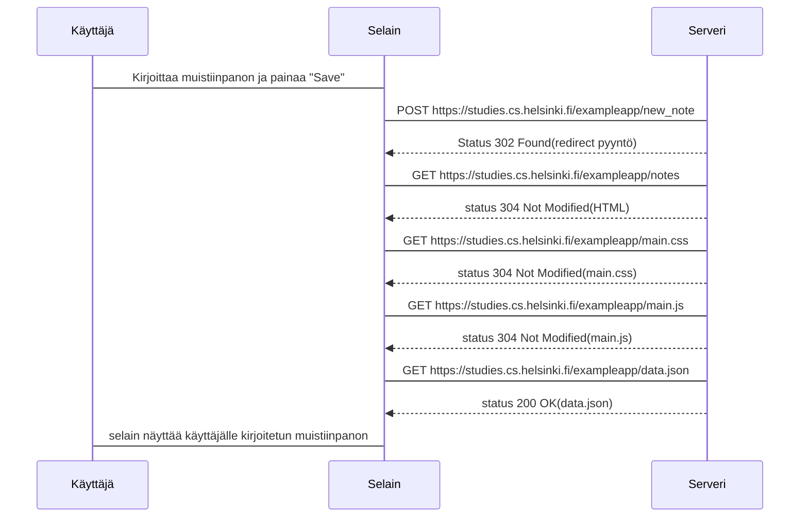
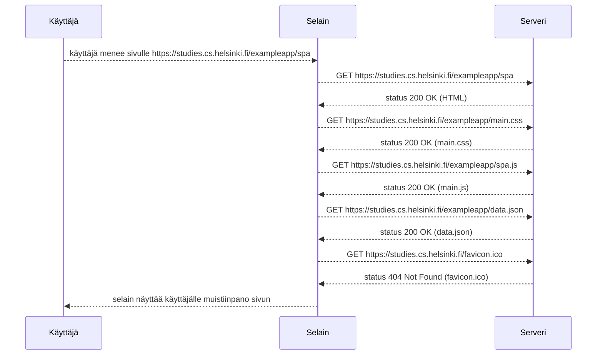

```mermaid
sequenceDiagram
  participant Käyttäjä
  participant Selain
  participant Serveri

  Käyttäjä-->>Selain: käyttäjä kirjoittaa muistiinpanon ja painaa "save"
  Selain-->>Serveri: POST https://studies.cs.helsinki.fi/exampleapp/new_note_spa

  note over Selain:
  type: json
  content	"test"
  date	"2025-05-27T02:05:17.987Z"
  message	"note created"
  end note

  Serveri-->>Selain: status 201 Created
  Selain-->>Käyttäjä: selain näyttää kirjoitetun muistiinpanon ilman että sivu lataa uudelleen
```
